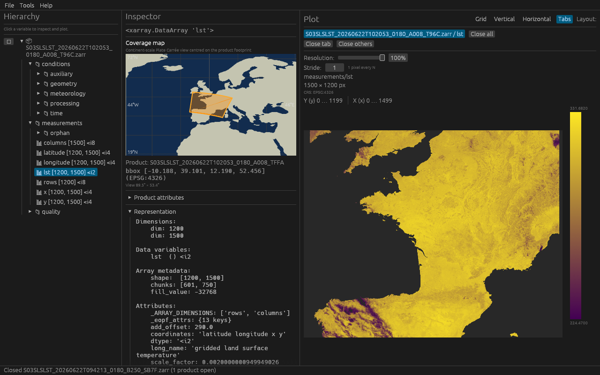

# Copernicus Viewer

A Rust GUI application to explore and visualize [EOPF](https://cpm.pages.eopf.copernicus.eu/eopf-cpm/main/PSFD/index.html) Zarr products.

## Features

- Open EOPF Zarr stores (`.zarr` directories, `.zarr.zip` archives, or `s3://` URIs on AWS S3)
- Open Sentinel-3 SAFE products (`.SEN3` directories) when built with the `safe` feature
- Browse the product hierarchy (groups and variables) in a tree view
- Inspect metadata with an xarray-inspired representation (DataTree / Group / DataArray with attributes)
- **Product attributes** tree for root metadata (nested STAC / EOPF attributes, foldable like the hierarchy)
- **Statistics and data preview** tables in the inspector for loaded array subsets
- **Async plot loading** with progress bar for large arrays
- **Geo-referenced plotting**: coordinate arrays, CRS, and axis extent labels on heatmaps
- **CF flag variables** with `flag_meanings` and `flag_values` / `flag_masks` (bitmask plots per flag)
- **Coverage map** in the inspector — adaptive Plate Carrée view (zooms to regional tiles, global view for wide footprints) with Natural Earth coastlines
- **Product comparison** (**Tools → Comparison**) — compare a reference and a new product (structure, variable data, CF flags) with user-defined thresholds and a pass/fail report; same logic via the `compare_products` example
- **S3 product download** — copy an open S3-hosted product to a local `.zarr` directory (**File → Download product…**, hierarchy **⬇** icon, or right-click on the product name)

## Quick start

This walkthrough opens a reference and a new EOPF product side by side (the screenshots below use Sentinel-3 SLSTR LST data). Pass your own `.zarr` paths:

```bash
cargo run -- /path/to/reference.zarr /path/to/new.zarr
```

Both products appear in the **Hierarchy** panel. Select **`measurements/lst`** to inspect metadata, view the coverage map, and plot the land-surface temperature heatmap:



Configure S3 bucket credentials from **File → Configure S3…**:


Open **Tools → Comparison**, pick the reference and new product, then run the check. The report lists structure, variable, and flag differences — here four auxiliary variables differ while 64 measurement variables pass:


The same comparison logic is available from the CLI:

```bash
cargo run --example compare_products -- /path/to/reference.zarr /path/to/new.zarr
```

To regenerate the README screenshots (maintainers):

```bash
COPERNICUS_VIEWER_CAPTURE_DEMO=docs/screenshots cargo run -- \
  /path/to/reference.zarr /path/to/new.zarr
```

## Requirements

- Rust 1.75+
- GPU support for the GUI (**wgpu** on Linux desktop, macOS, and Windows; **Glow**/OpenGL on WSL2 — see [WSL2 graphics](#wsl2-graphics))

### Sentinel-3 SAFE (optional `safe` feature)

The `safe` Cargo feature enables `.SEN3` support via NetCDF. It is **on by default** for local development.

| Build | Command | NetCDF at build time | Runtime install |
|-------|---------|----------------------|-----------------|
| Default (Zarr + SAFE, system libs) | `cargo build` | `libnetcdf-dev` (Linux) | None for NetCDF if you ship `-safe` with `netcdf-static` |
| Self-contained SAFE binary | `cargo build --features netcdf-static` | cmake + C++ toolchain | None — NetCDF/HDF5/zlib embedded |
| Zarr-only (no SAFE) | `cargo build --no-default-features --features dialog-portal` | None | N/A |

**GitHub Releases** ship two variants per platform: a Zarr-only binary and a `-safe` binary built with `netcdf-static` (no NetCDF install required for end users).

On Linux, system development builds need:

```bash
sudo apt install libnetcdf-dev
```

Without `libnetcdf-dev`, use static linking:

```bash
cargo build --features netcdf-static
```

### WSL2 / Linux system packages

On **WSLg** (default on recent WSL2), the app uses Wayland automatically — no extra packages needed.

If you use **X11 forwarding** to an external X server (VcXsrv, X410, …), install:

```bash
sudo apt install libxkbcommon-x11-0 libgl1-mesa-dri
```

Runtime for the GTK file dialog (optional build): `libgtk-3-0`.

**Opening products:** **File → Open Zarr…** opens an in-app browser for local `.zarr` directories, `.zarr.zip` archives, and (when built with `safe`) `.SEN3` SAFE directories — click or double-click a product, or paste a path and press **Open**. Use **S3** in that dialog to browse configured buckets and prefixes on object storage (see [S3 object storage](#s3-object-storage)). You can also paste an `s3://bucket/path/product.zarr` URI directly. Use **System picker…** for the native file chooser on local paths; it automatically uses a folder picker for `.zarr` paths and a file picker for `.zip` paths. You can open several products at once; each appears as a top-level entry in the **Hierarchy** panel. Close one with **✕** next to its name or **File → Close product**. Opening a product reads hierarchy metadata only; array values are loaded when you select a variable to plot.

If the native dialog is empty or opens twice on WSL, rebuild with the GTK backend:

```bash
sudo apt install libgtk-3-dev
cargo build --no-default-features --features dialog-gtk
cargo run --no-default-features --features dialog-gtk
```

### WSL2 graphics

The app picks a renderer from your WSL environment (override with `COPERNICUS_VIEWER_GL`):

| Environment | Default | Backend |
|-------------|---------|---------|
| WSLg (Wayland) | GPU OpenGL | Glow |
| WSL + X11 forwarding | Mesa llvmpipe (software) | Glow |
| Linux desktop / macOS / Windows | GPU | wgpu |

On **WSLg** (`WAYLAND_DISPLAY` set), the default is **Glow with GPU acceleration**. Mesa llvmpipe is not compatible with WSLg/Wayland.

On **WSL over X11** (VcXsrv, X410, …), the default is **Glow with Mesa llvmpipe** software rendering, which is much more stable than ZINK/EGL when resizing windows. Vsync is disabled on this path; the app sets `LIBGL_ALWAYS_SOFTWARE=1` and related Mesa env vars automatically.

```bash
# Force Mesa llvmpipe + Glow (X11 only; on WSLg falls back to GPU Glow with a warning)
COPERNICUS_VIEWER_GL=software cargo run

# GPU: Glow on WSL, wgpu elsewhere
COPERNICUS_VIEWER_GL=hardware cargo run

# Force wgpu everywhere (expert — may fail on WSL with EGL/ZINK errors)
COPERNICUS_VIEWER_GL=wgpu cargo run

# Explicit auto-detection (same as unset)
COPERNICUS_VIEWER_GL=auto cargo run
```

`native` is an alias for `wgpu`.

## Install

### Rust (crates.io)

```bash
cargo install copernicus_viewer
copernicus_viewer
```

Requires a Rust toolchain and GPU support (same as [Requirements](#requirements)).

### Prebuilt binaries (GitHub Releases)

Download the archive for your platform from [GitHub Releases](https://github.com/vlevasseur073/copernicus_viewer/releases), extract it, and run:

- **`copernicus_viewer-{version}-{target}.tar.gz` / `.zip`** — Zarr-only (no `.SEN3` support)
- **`copernicus_viewer-{version}-{target}-safe.tar.gz` / `.zip`** — Zarr + Sentinel-3 SAFE (self-contained NetCDF)

```bash
# Linux / macOS
./copernicus_viewer /path/to/product.zarr

# Windows
copernicus_viewer.exe C:\path\to\product.zarr
```

Verify downloads with the `SHA256SUMS.txt` file attached to each release.

## Build & Run

```bash
# Optional: generate a local sample product for testing
cargo run --example create_sample_zarr
```

### Formatting and linting

```bash
cargo fmt --all
cargo clippy --locked --all-targets -- -D warnings
cargo test --locked
```

CI runs `cargo fmt --check`, Clippy (`-D warnings`), and tests on every push and pull request.

Optional [pre-commit](https://pre-commit.com) hooks run `cargo fmt` and Clippy before each commit:

```bash
pip install pre-commit   # or: brew install pre-commit
pre-commit install
pre-commit run --all-files   # verify without committing
```

```bash
# Compare two products from the CLI (reference vs new)
cargo run --example compare_products -- reference.zarr new.zarr

cargo run
```

Use **File → Open Zarr…** to load additional EOPF products. Pass one or more paths on the command line:

```bash
cargo run -- /path/to/product_a.zarr /path/to/product_b.zarr
cargo run -- s3://my-eopf-bucket/eopf/products/S03OLCEFR_202309.zarr
```

## S3 object storage

Remote EOPF Zarr directory stores on AWS S3 (including custom endpoints) can be opened with an `s3://` URI from the command line or by pasting the URI in **File → Open Zarr…**. You can also browse remote products in that dialog: click **S3** to list buckets from your config file, then navigate prefixes and double-click a `.zarr` product to open it. Use **Local** to return to filesystem browsing. The in-app directory listing for local paths is unchanged.

### Credentials

Credentials are resolved in this order (bucket name from the URI selects the INI section):

1. Config file from `COPERNICUS_VIEWER_S3_CONFIG` or `S3_CONFIG` (if set)
2. Default config at `%APPDATA%\cp-rs\s3.conf` (Windows) or `~/.config/cp-rs/s3.conf` (Unix)
3. `S3_ACCESS_KEY_ID`, `S3_SECRET_ACCESS_KEY`, `S3_ENDPOINT`, `S3_REGION`
4. `AWS_ACCESS_KEY_ID`, `AWS_SECRET_ACCESS_KEY`, `AWS_ENDPOINT_URL`, `AWS_REGION`

INI format (rclone-style), one section per bucket:

```ini
[my-eopf-bucket]
type = s3
access_key_id = AKID
secret_access_key = SKEY
region = eu-west-1
endpoint = https://s3.example.com
```

Nested paths are resolved to the Zarr product root automatically (same as local paths), e.g. `s3://bucket/path/product.zarr/measurements/lst` opens `s3://bucket/path/product.zarr`.

`.zarr.zip` archives on S3 are not supported in this version.

### Downloading S3 products

When an S3 product is open, download it to your local filesystem as a `.zarr` directory:

- **File → Download product…** (enabled when the selected product is on S3)
- **⬇** next to the product name in the **Hierarchy** panel
- Right-click the product name → **Download product…**

Choose a parent folder in the native dialog; the product is saved as `<folder>/<product-name>.zarr` with the same Zarr layout as on S3. Progress appears in the status bar. The download fails if that destination folder already exists.

The library API [`download_s3_product`](src/zarr/download.rs) is also available for scripts and automation.

## Releasing (maintainers)

1. Bump `version` in `Cargo.toml` and commit.
2. Create and push an annotated tag: `git tag -a v0.2.0 -m "v0.2.0" && git push origin v0.2.0`
3. Ensure the repository secret `CARGO_REGISTRY_TOKEN` is set ([crates.io token](https://crates.io/settings/tokens)).

The [release workflow](.github/workflows/release.yml) runs tests, builds binaries for Linux, Windows, and macOS (x86_64 + arm64), attaches them to a GitHub Release, publishes to crates.io, and updates [`CHANGELOG.md`](CHANGELOG.md) from git history using [git-cliff](https://git-cliff.org).

Preview unreleased changes locally (set `GITHUB_TOKEN` for PR metadata from the GitHub API):

```bash
cargo install git-cliff --locked
export GITHUB_TOKEN=ghp_...   # optional; `gh auth token` works too
git cliff --config cliff.toml --unreleased
```

To include linked issues in the changelog, reference them in commit or PR descriptions (`Fixes #123`, `Closes #456`, or `#789`). git-cliff does not query the GitHub Issues API for all closed issues in a release — only PR metadata (via the API) and issue numbers mentioned in commit text (via `link_parsers` in [`cliff.toml`](cliff.toml)).

Regenerate the full changelog:

```bash
git cliff --config cliff.toml --output CHANGELOG.md
```

For the **first** crates.io publish, create an API token at [crates.io/settings/tokens](https://crates.io/settings/tokens), add it as a GitHub secret, then either push a tag or run locally:

```bash
cargo publish
```

## EOPF Zarr structure

EOPF products follow the standard Zarr hierarchy described in [PSFD §4.4](https://cpm.pages.eopf.copernicus.eu/eopf-cpm/main/PSFD/4-storage-formats.html#zarr-representation-of-eopf-data-products):

- Root `.zattrs` — product-level metadata (STAC attributes)
- `.zmetadata` — consolidated metadata
- Group directories (`measurements`, `quality`, `conditions`, …) with `.zgroup`
- Variable leaf directories with `.zarray`, `.zattrs`, and chunk files

Sample data is available from the [EOPF Sentinel Zarr Samples Service](https://zarr.eopf.copernicus.eu/).

Coastline data: [Natural Earth 110m land](https://www.naturalearthdata.com/) (public domain).

## License

Licensed under either of:

- Apache License, Version 2.0 ([LICENSE-APACHE](LICENSE-APACHE) or http://www.apache.org/licenses/LICENSE-2.0)
- MIT license ([LICENSE-MIT](LICENSE-MIT))

at your option.
