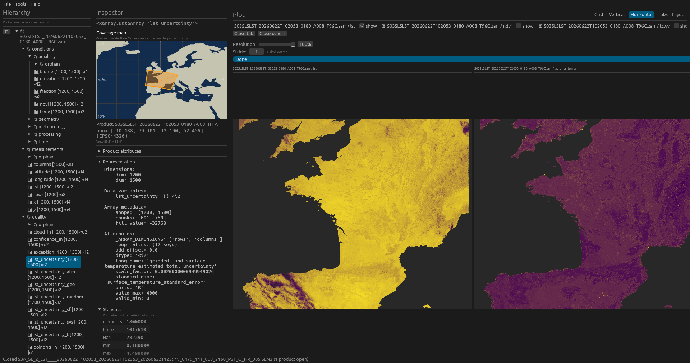
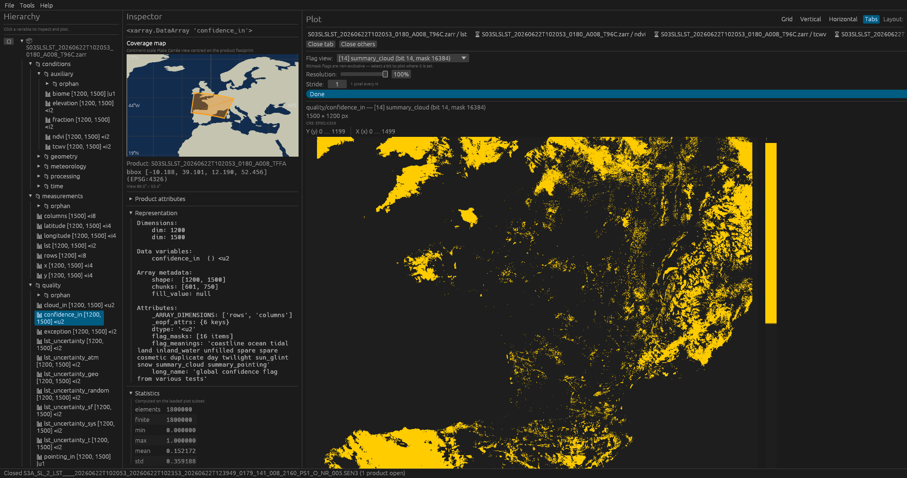
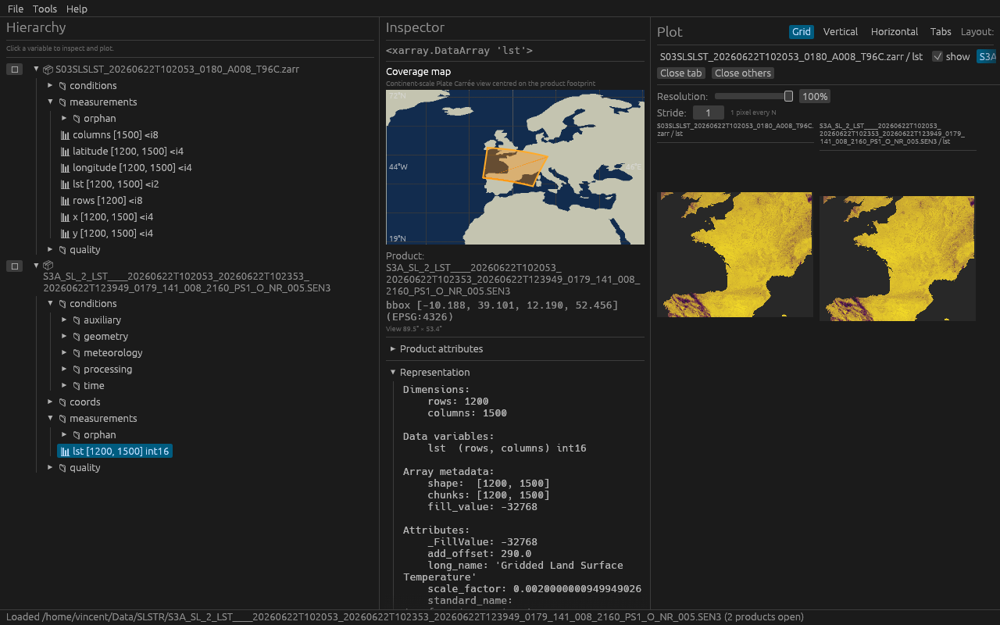
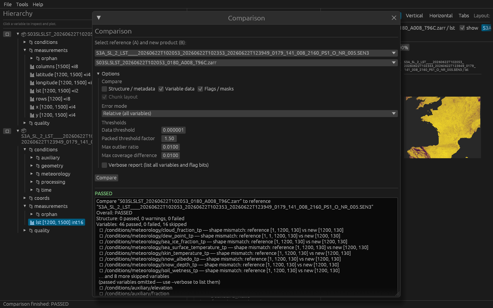
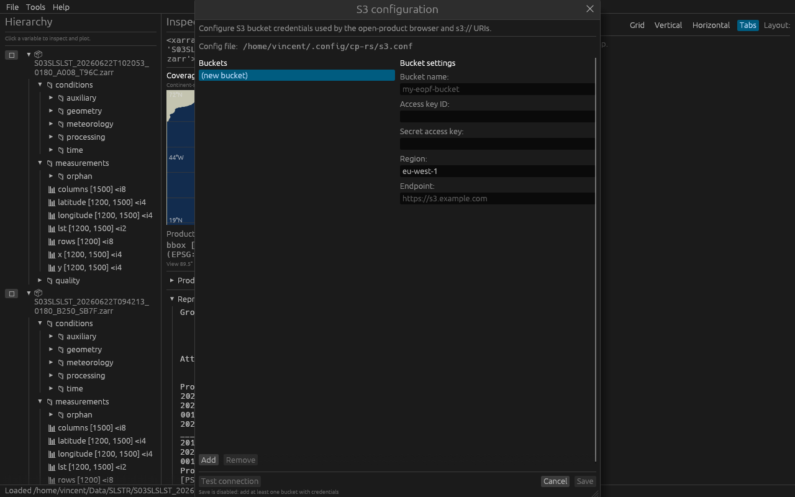

# Tutorial

This walkthrough uses **Sentinel-3 SLSTR Level-2 LST** (*Land Surface Temperature*) products in the [EOPF Zarr](https://cpm.pages.eopf.copernicus.eu/eopf-cpm/main/PSFD/index.html) format and the legacy **SAFE** (`.SEN3`) format. You will open products, plot variables, inspect quality flags, compare a reprocessed dataset against a reference, and configure S3 credentials for remote storage.

## Prerequisites

- A built copy of Copernicus Viewer (see the [README](../README.md) for build instructions).
- At least one EOPF Zarr LST product (local directory or `s3://` URI).
- Optionally, the matching `.SEN3` product for the SAFE and comparison steps (requires the default `safe` feature).

Launch the viewer with one or two products already on the command line:

```bash
cargo run -- /path/to/reference.zarr /path/to/new.zarr
```

You can also open products later from **File → Open Zarr…**.

---

## Open the product and plot the land-surface temperature heatmap

When a product loads, it appears as a top-level entry in the **Hierarchy** panel on the left. Expand **measurements** and click **`lst`** — the gridded land-surface temperature field (`1200 × 1500`, 16-bit integer with CF scale/offset).

The **Inspector** (centre) shows an xarray-style summary: dimensions, chunking, attributes, statistics, and a **Coverage** map with the product footprint over Europe. The **Plot** panel (right) loads the heatmap asynchronously; a progress bar appears while data is read and decoded.


The plot is geo-referenced: axis labels show row/column indices and the colour bar spans decoded physical values (kelvin). Use the **Resolution** slider (1–100 %) to read a centre crop at lower spatial resolution — useful for very large arrays. **Stride** keeps every *N*th pixel along each axis for faster rendering.

### Add another variable to the plot workspace

Click any other array in the hierarchy to open it in a new plot tab. Copernicus Viewer deduplicates tabs per product and variable, so selecting the same field again focuses the existing tab.

To compare two variables side by side, switch the layout to **Horizontal** (or **Vertical** / **Grid**) in the plot toolbar. The screenshot below shows **`lst`** next to **`lst_uncertainty`** from the **quality** group:



Each tab has its own resolution and stride controls. Close a tab with **✕** on the tab label.

### Plot a CF quality flag

Many quality variables carry `flag_meanings` and `flag_values` (or bit masks). Select a flag array such as **`confidence_in`** under **quality**, then choose a flag layer from the **Flag** drop-down in the plot panel — for example **summary_cloud** (bit 14):



Flag plots use a two-colour scale (set / unset). Raw values remain available via **Flag → Raw values**.

---

## Open the legacy SAFE product

Sentinel-3 products distributed as `.SEN3` directories can be opened the same way as Zarr stores: **File → Open Zarr…**, browse to the `.SEN3` folder, or pass the path on the command line. The viewer maps NetCDF variables to the same EOPF-like hierarchy used for Zarr (groups such as **measurements**, **conditions**, **quality**).



In the example above, both the Zarr and SAFE versions of the same acquisition are open. The SAFE **`lst`** array lives under **measurements → orphan** and shares the same `1200 × 1500` grid and CF attributes (`scale_factor`, `add_offset`, `_FillValue`) as the EOPF product. Select it to plot or inspect metadata exactly as for Zarr.

> **Note:** Opening a product reads hierarchy metadata only. Array values are loaded when you plot or when a comparison run reads them.

---

## Compare both products

With a reference and a new product open (Zarr vs Zarr, or SAFE vs Zarr), open **Tools → Comparison**.

1. Choose **Reference (A)** and **New product (B)** from the drop-downs.
2. Enable the checks you need — **Structure**, **Variable data**, and **Flags / masks** are available independently.
3. Set thresholds (absolute/relative error, maximum outlier ratio) and click **Run comparison**.



The report lists each shared hierarchy path with **PASS**, **FAIL**, or **SKIP**. Structure differences (missing variables, dtype/shape mismatches) appear first; numerical checks compare chunk-aligned subsets on the reference grid. In this example 46 variables pass; auxiliary meteorology fields may be skipped when they exist in only one product format.

The same logic is available from the CLI:

```bash
cargo run --example compare_products -- /path/to/reference.zarr /path/to/new.zarr
```

---

## Configure S3 credentials

Remote EOPF products on AWS S3 (including custom endpoints) are opened with `s3://bucket/path/product.zarr` or via the in-app browser. Credentials are stored in an INI file — by default `~/.config/cp-rs/s3.conf` on Linux and macOS.

Open **File → Configure S3…** to edit buckets without leaving the app:



For each bucket section, provide:

| Field | Example |
|-------|---------|
| Bucket name | `my-eopf-bucket` |
| Access key ID | your access key |
| Secret access key | your secret key |
| Region | `eu-west-1` |
| Endpoint | `https://s3.example.com` (optional, for S3-compatible storage) |

Click **Add** to create a section, fill in the fields, then **Save**. Use **Test connection** to verify credentials before saving.

Alternatively, set environment variables (`AWS_ACCESS_KEY_ID`, `AWS_SECRET_ACCESS_KEY`, …) or point to a custom file with `COPERNICUS_VIEWER_S3_CONFIG`. See the [S3 section in the README](../README.md#s3-object-storage) for the full resolution order and URI examples.

Once configured, use **File → Open Zarr… → S3** to browse buckets and prefixes, or paste an `s3://` URI directly. Download an open S3 product locally via **File → Download product…**.

---

## Next steps

- Inspect root metadata under **Product attributes** in the inspector (STAC / EOPF fields, foldable tree).
- Download sample Zarr products from the [EOPF Sentinel Zarr Samples Service](https://zarr.eopf.copernicus.eu/).
- Regenerate the screenshots in this tutorial (maintainers):

```bash
COPERNICUS_VIEWER_CAPTURE_DEMO=docs/screenshots cargo run -- \
  /path/to/reference.zarr /path/to/new.zarr
```
